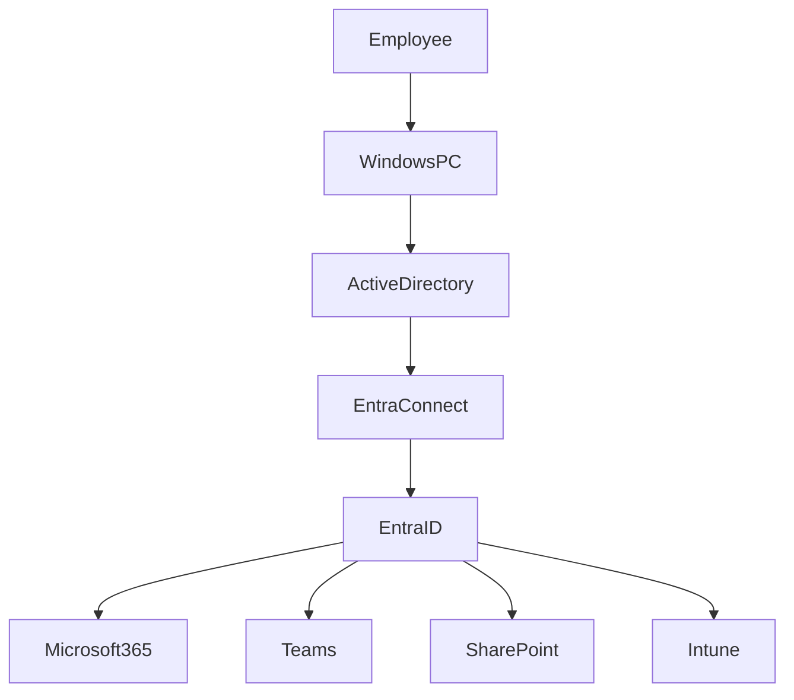
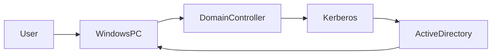
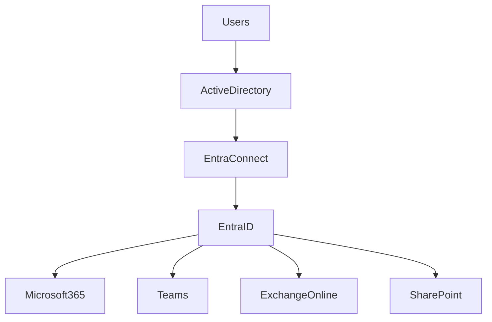

## Why This Article Matters

One of the biggest misconceptions I still hear is:

> "We're using Microsoft 365 now, so we don't need Active Directory anymore."

In reality, that's rarely true.

Most organizations today don't run **only** Active Directory or **only** Microsoft Entra ID. Instead, they operate in a **hybrid identity environment**, where on-premises infrastructure and cloud services work together.

For IT Support professionals, understanding this hybrid model is far more valuable than simply knowing the differences between the two technologies.

Whether you're resetting passwords, troubleshooting login failures, deploying new laptops, or investigating authentication issues, knowing **where identity lives and how authentication works** can dramatically reduce troubleshooting time.

This article explains not only *what* Active Directory and Microsoft Entra ID are, but also *why both continue to play important roles in modern enterprise IT.*

---

# The Evolution of Enterprise Identity

Enterprise identity management has changed significantly over the past two decades.

### Traditional On-Premises Infrastructure

Years ago, nearly everything lived inside the corporate network:

- Windows PCs
- File servers
- Exchange Server
- SQL Server
- Print servers
- Internal applications

Employees authenticated against a local **Active Directory Domain Controller** using Kerberos or NTLM.

Everything stayed inside the company network.

---

### Cloud Services Changed Everything

As organizations adopted cloud services such as:

- Microsoft 365
- Teams
- SharePoint Online
- Exchange Online
- Azure Virtual Desktop
- SaaS business applications

Identity management needed to expand beyond the corporate LAN.

Microsoft introduced Azure Active Directory, now officially renamed **Microsoft Entra ID**, to provide cloud-native identity and authentication services.

Instead of replacing Active Directory, it extended Microsoft's identity platform into the cloud.

---

### Today's Reality

Today, most medium and large organizations look something like this:



This hybrid architecture has become the standard enterprise deployment model.

---

# Active Directory: The Foundation of Windows Enterprise

Active Directory (AD) has been the backbone of Windows enterprise infrastructure since Windows 2000.

It provides centralized identity management for:

- Users
- Computers
- Security groups
- Organizational Units (OUs)
- Group Policies
- Authentication
- Authorization

A Domain Controller acts as the authoritative source for identities inside the corporate network.

When a user signs in to a domain-joined Windows computer, Active Directory verifies their credentials and determines what resources they are allowed to access.

---

## Core Services Provided by Active Directory

Active Directory does much more than store usernames and passwords.

Typical enterprise services include:

- User account management
- Computer account management
- Group membership
- Password policies
- Account lockout policies
- Group Policy Objects (GPO)
- Kerberos authentication
- LDAP directory services
- Organizational Unit delegation
- DNS integration

For many organizations, Active Directory also becomes the backbone of Windows administration.

---

# Microsoft Entra ID: Identity Beyond the Corporate Network

Microsoft Entra ID serves a different purpose.

Instead of managing computers inside a Windows domain, it manages identities for cloud services.

Examples include:

- Microsoft 365
- Teams
- Outlook Web
- SharePoint Online
- OneDrive
- Azure Portal
- Thousands of SaaS applications

Rather than relying on domain controllers and Kerberos, Entra ID uses modern authentication protocols designed for Internet-connected services.

These include:

- OAuth 2.0
- OpenID Connect
- SAML

This allows users to securely access cloud applications from anywhere while supporting modern security features such as:

- Multi-Factor Authentication (MFA)
- Conditional Access
- Passwordless Authentication
- Single Sign-On (SSO)
- Identity Protection

---

# Active Directory vs Microsoft Entra ID

Although they both manage identities, they solve different problems.

| Active Directory | Microsoft Entra ID |
|-----------------|--------------------|
| On-premises | Cloud-based |
| Domain Controller | Cloud Directory |
| Kerberos / NTLM | OAuth 2.0 / OpenID Connect / SAML |
| LDAP | REST APIs |
| Group Policy | Intune & Cloud Policies |
| Windows Domain Join | Microsoft Entra Join |
| Primarily Windows devices | Windows, macOS, iOS, Android, Linux |
| Local network authentication | Internet-based authentication |

The important takeaway is this:

> Microsoft Entra ID is **not** a cloud version of Active Directory.

It is a completely different identity platform built for a different generation of applications.

---

# Understanding Authentication

This is where many IT professionals become confused.

Both systems authenticate users.

However, they authenticate users differently.

## Windows Domain Login

When a user presses **Ctrl + Alt + Delete** and signs into a Windows domain computer, the authentication flow typically looks like this:



The Domain Controller validates the user's identity and issues a Kerberos ticket that allows access to domain resources.

This process usually happens entirely inside the corporate network.

---

## Microsoft 365 Login

Logging into Microsoft Teams or Outlook on the web follows a very different process.


Instead of Kerberos tickets, users receive modern authentication tokens that grant access to cloud applications.

This approach enables secure access from virtually anywhere without requiring a VPN connection.

---

# Why Hybrid Identity Exists

If both systems authenticate users, why keep both?

Because each solves a different problem.

Active Directory excels at:

- Managing Windows computers
- Group Policy
- Legacy applications
- File servers
- Internal authentication
- Enterprise infrastructure

Microsoft Entra ID excels at:

- Cloud applications
- Remote work
- Mobile devices
- Multi-Factor Authentication
- Conditional Access
- SaaS integration
- Modern authentication

Organizations rarely choose one over the other.

Instead, they combine the strengths of both platforms to support modern business needs.

---

# A Day in the Life of an IT Support Engineer

Many common support requests involve both identity platforms.

For example:

| User Issue | Likely Technology |
|------------|------------------|
| Windows domain login failed | Active Directory |
| User account locked | Active Directory |
| Password reset | Active Directory (or synchronized identity) |
| Teams sign-in issue | Microsoft Entra ID |
| Microsoft 365 license problem | Microsoft Entra ID |
| MFA prompt not working | Microsoft Entra ID |
| New laptop domain join | Active Directory |
| Intune enrollment failure | Microsoft Entra ID |
| Conditional Access blocked login | Microsoft Entra ID |
| Group Policy not applying | Active Directory |

---

# A Real-World Troubleshooting Scenario

Understanding where authentication happens is one of the most valuable troubleshooting skills for an IT Support professional.

Consider this common support request:

> "I can log into my Windows laptop, but Microsoft Teams keeps asking me to sign in."

Many junior technicians immediately reset the user's password.

However, an experienced support engineer will first determine **which identity system is failing.**

A structured troubleshooting approach might look like this:

```text
Can the user sign into Windows?

        │
       Yes
        │
        ▼
Can the user access Microsoft 365?

        │
       No
        │
        ▼
Check Microsoft Entra ID

• MFA status
• Conditional Access
• License assignment
• Sign-in logs
• Account status
```

In this scenario:

- Active Directory is functioning correctly because the user successfully authenticated to Windows.
- The issue is likely related to Microsoft Entra ID rather than the on-premises domain.

By asking the right questions first, support engineers can avoid unnecessary password resets and significantly reduce troubleshooting time.

---

## Another Common Example

Imagine a user reports:

> "I changed my password this morning, but Outlook on my laptop keeps prompting for credentials."

Possible causes include:

- Password synchronization has not completed
- Microsoft Entra Connect synchronization is delayed
- Cached Windows credentials
- Expired OAuth tokens
- Conditional Access requiring reauthentication

Again, understanding how Active Directory and Microsoft Entra ID interact allows support engineers to investigate efficiently instead of guessing.

---

# Understanding Microsoft Entra Connect

Most hybrid organizations synchronize identities between Active Directory and Microsoft Entra ID.

This synchronization is typically handled by **Microsoft Entra Connect** (formerly Azure AD Connect).

A simplified architecture looks like this:



The synchronization process allows organizations to maintain a single user identity while supporting both on-premises and cloud services.

However, synchronization itself can become another point of failure.

Common issues include:

- Password synchronization delays
- Synchronization service failures
- Duplicate identities
- Immutable ID mismatches
- Account conflicts
- Attribute synchronization errors

Understanding these components is increasingly important for modern IT Support teams.

---

# Security Considerations

Identity has become one of the most important security boundaries in enterprise IT.

While Active Directory and Microsoft Entra ID both provide authentication services, they protect organizations in different ways.

## Active Directory

Because Active Directory has existed for over twenty years, it continues to support legacy technologies for compatibility.

These include:

- NTLM authentication
- Legacy LDAP applications
- Older Windows operating systems

While necessary for some environments, legacy protocols can introduce additional security risks if not properly managed.

Security best practices typically include:

- Limiting NTLM usage
- Enforcing strong password policies
- Protecting Domain Controllers
- Restricting privileged accounts
- Applying security updates promptly
- Monitoring administrative activity

---

## Microsoft Entra ID

Microsoft Entra ID focuses heavily on modern identity protection.

Key security capabilities include:

- Multi-Factor Authentication (MFA)
- Conditional Access
- Passwordless authentication
- Risk-based sign-in detection
- Identity Protection
- Single Sign-On (SSO)

Instead of relying solely on usernames and passwords, organizations can evaluate multiple factors before granting access.

For example:

- User location
- Device compliance
- Sign-in risk
- Network location
- Device health
- User behavior

This approach significantly improves security for remote work environments.

---

# Why IT Support Professionals Should Learn Both

Some people assume identity management is only relevant for system administrators.

In reality, many daily support tasks involve identity systems.

Examples include:

| Support Task | Technology |
|--------------|------------|
| Reset user password | Active Directory |
| Unlock user account | Active Directory |
| Join computer to domain | Active Directory |
| Troubleshoot Group Policy | Active Directory |
| Configure MFA | Microsoft Entra ID |
| Assign Microsoft 365 licenses | Microsoft Entra ID |
| Investigate sign-in failures | Microsoft Entra ID |
| Enroll devices into Intune | Microsoft Entra ID |
| Review Conditional Access failures | Microsoft Entra ID |

Support engineers who understand both environments are often able to resolve incidents much faster than those who treat every authentication issue as a password problem.

---

# Best Practices for Modern Enterprise Identity

Organizations operating hybrid environments should consider several best practices.

### Use Multi-Factor Authentication

MFA should be enabled wherever possible, especially for administrative accounts.

---

### Keep Active Directory Healthy

Regularly review:

- Group memberships
- Privileged accounts
- Domain Controller health
- Replication status
- DNS configuration

Healthy Active Directory remains the foundation of many enterprise environments.

---

### Embrace Modern Authentication

Where possible:

- Disable legacy authentication protocols
- Adopt OAuth-based authentication
- Implement Conditional Access policies

These changes reduce the organization's attack surface while improving user experience.

---

### Understand the Entire Authentication Journey

When troubleshooting, avoid focusing on only one platform.

Instead, ask questions such as:

- Is this Windows authentication?
- Is this Microsoft 365 authentication?
- Is this VPN authentication?
- Is synchronization working?
- Is MFA involved?
- Is Conditional Access blocking the user?

Following the authentication path often reveals the root cause much more quickly than trial-and-error troubleshooting.

---

# Looking Ahead

Many organizations continue to modernize their IT infrastructure.

Some are moving entirely to cloud-native environments.

Others continue to operate traditional Active Directory domains.

Most enterprises, however, fall somewhere in between.

Hybrid identity is no longer a temporary transition—it has become the standard architecture for many organizations.

As cloud adoption continues to grow, Microsoft Entra ID will become increasingly important.

At the same time, Active Directory will continue supporting countless Windows servers, legacy applications, manufacturing systems, healthcare environments, educational institutions, and government networks.

Understanding both technologies is becoming a core skill for IT professionals rather than an optional specialization.

---

# Final Thoughts

Despite frequent discussions about "moving everything to the cloud," Active Directory remains deeply embedded in enterprise infrastructure.

At the same time, Microsoft Entra ID has become the gateway to modern cloud services, remote work, and Zero Trust security.

Rather than competing technologies, they complement one another.

For IT Support professionals, understanding how these platforms work together provides a significant advantage when troubleshooting authentication issues, supporting end users, and managing hybrid environments.

The future of enterprise identity is not **Active Directory** or **Microsoft Entra ID**.

It is understanding **how they work together**.

---

# Further Reading

- Microsoft Learn – Active Directory Domain Services
  https://learn.microsoft.com/windows-server/identity/ad-ds/

- Microsoft Learn – Microsoft Entra ID Documentation
  https://learn.microsoft.com/entra/

- Microsoft Learn – Microsoft Entra Connect
  https://learn.microsoft.com/entra/identity/hybrid/connect/

- Microsoft Learn – Conditional Access
  https://learn.microsoft.com/entra/identity/conditional-access/

- Microsoft Learn – Zero Trust Guidance
  https://learn.microsoft.com/security/zero-trust/